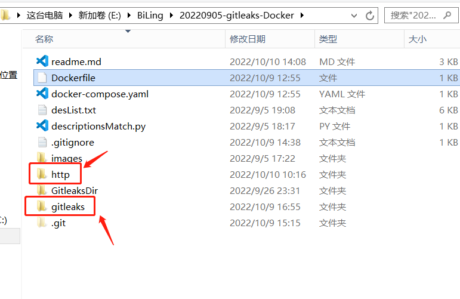
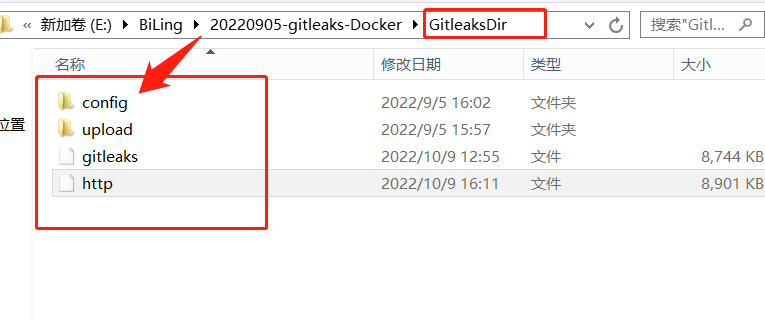
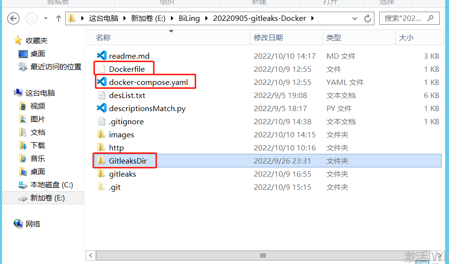
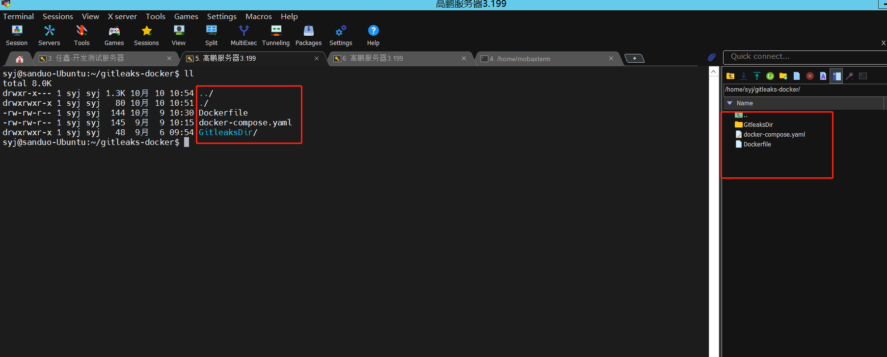
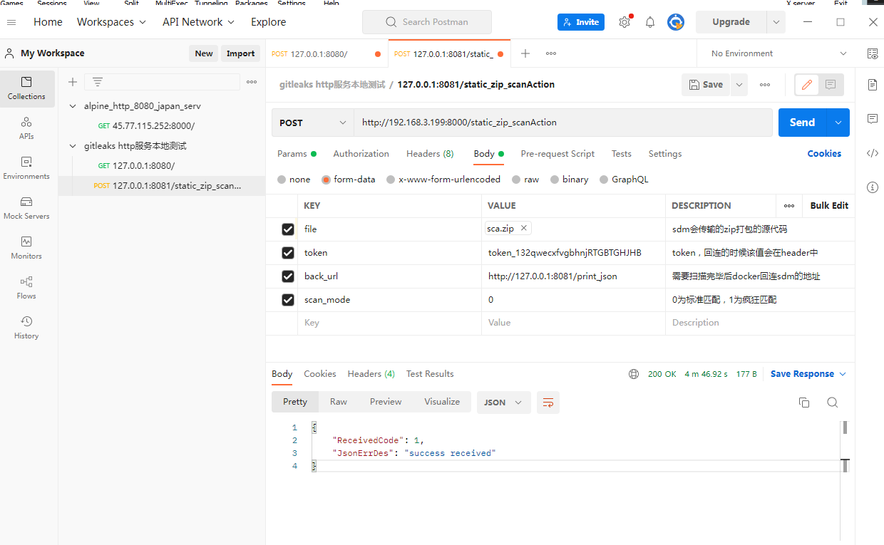
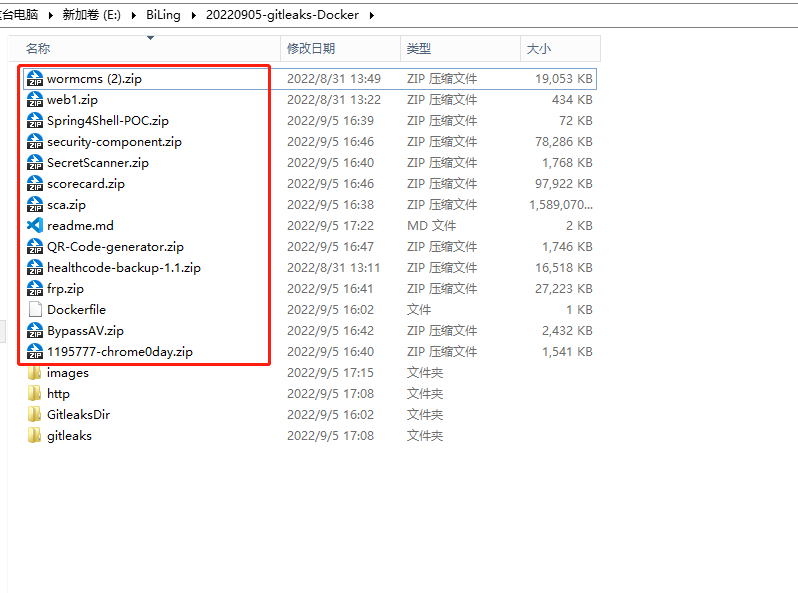

# 背景

2022-11-16 开始在docker中隐藏规则文件，全面消除gitleaks标识，移除单独的打包目录项目，移动到本项目中。

SecretDetection 2022-11-2要求打包凭证检测程序

2022/10/10 依照温海林要求更新下部署文档

2022.9.5 基本完毕Gitleaks Docker

8.31 贝总要求gitleaks进行docker化

8.18-8.30 在工商银行进行了硬编码的服务


# 主要目录说明

### Docker相关部分

Dockerfile及docker-compose.yaml 生成Docker使用
http 是Docker的HTTP服务部分
SecretDetection 是Docker的二进制扫描服务部分，工具的使用和打包方法请详见该目录下说明文件。
SecretDetectionDir 放已经编译好的程序以及规则，方便生成docker

### 过度文件

RulesDescriptionMatch 非正式目录，给任鑫提供接口时的过度文件

SecretDetectionDriver 用来批量查看不同熵值扫描的影响


# Gitleaks Docker

## 部署

dockerfile经过打包之后，生成的image仅40MB左右。

### 组成部分介绍

程序除了Dockerfile和docker-compose.yaml之外，主要有两部分组成:

* http
* SecretDetection



http主要负责提供web接口；gitleaks为优化过的gitleaks。这两个内容都需要

```shell
set GOOS=linux
set GOARCH=amd64
go build
```

获得名为`SecretDetection`和`http`的二进制文件。如图，有`SecretDetectionDir`的目录，里面已放入我编译好的二进制文件。



其中的`config`目录存放一些基本的配置文件以及规则。

### 如何部署

需要将`Dockerfile`、`docker-compose.yaml`以及`SecretDetectionDir`目录拖入服务器中即可。





在该目录下运行`docker-compose up -d`命令，就可以启动程序。docker的映射端口可随意更改。

## 程序工作流程

http在接收参数后，赋值file到本地目录，就向客户端发送一个json表示连接正常，然后通过header中的`Connection: close`使得客户端断开连接。

调用子进程扫描完项目后，回连SDM的back_url发送json，然后删除本地的项目的临时目录。

docker服务不需要出网，对硬编码的扫描是本地扫描。

## 源代码

目录 `http` 使用golang的`net/http`写的http服务，命令行调用gitleaks进行工作，大部分配置可以从`config/local_config.yaml`直接进行配置

目录 `SecretDetection` 是经过优化后的SecretDetection，对其中的线程数、参数等信息进行了更改。

`config/gitleaks.toml`没什么用了其实，程序使用的`gitleaks-all-kill.toml`和`gitleaks-n-all-kill.toml`更多一些。`gitleaks-all-kill.toml`中有非常容易导致误报的规则，用来进行疯狂模式的硬编码匹配；`gitleaks-n-all-kill.toml`较为标准一些，误报率低。

# 接口



# 测试

用几个如图的zip包进行了测试，发现运行良好。只有sca项目用时过长，依然在分析其原因。

多线程处理、sdm的回连URI异常等问题均稳定，不影响主进程的http开启。



# TODO

- [x] 优化toml中的规则命名，使得sdm进行统计时可以区别大类统计与详细统计模式
- [x] 异常处理，如果遇到类似sca.zip的这类文件，扫描时长过于长
- [x] 解决git log 扫描问题：发现程序本身使用git扫描，该问题和任鑫之前遗留了较长时间，单纯是因为没有安装git，已解决。


